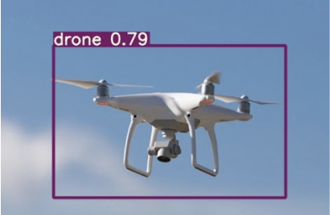

# Capstone Project - Drone Detection using YOLOv5

The ipython notebook is meant to be read in conjunction with .

The final presentation can be found on google slides <a href = "https://docs.google.com/presentation/d/1HI6LjlMR3R_NN2q8LimoOgc7e9PM0F7g5RI7BUjOe8k/edit?usp=sharing">here</a>

## Problem Statement
There is an increasing availability of small, cheap unmanned aerial vehicles equipped with cameras. As such, there is a corresponding requirement for a low-cost, quick and easily deployable system to alert security stakeholders of the presence of such unmanned vehicles so that further actions can be taken.

## Executive Summary
A dataset of 2492 drone images were uploaded to Roboflow. The dataset was then examined and any incorrect bounding boxes corrected and inappropriate images removed. The images were then further transformed, resulting in a final dataset of 4984 images. A custom YOLOv5m model was then trained on the dataset using Google Colab, resulting in a high score of 0.985 mAP. The best weights were then saved, downloaded and utilized to create a standalone deployment model.

## Conclusion/Discussion

While the production model works as a standalone system, more work will need to be done to tie in the detections with a customer's alerting system/workflow.

Additionally, the availability of several versions of YOLOv5 means that any such model might have to be retrained on bigger/smaller networks to suit the customer's hardware requriements and operational needs. Further tweaking of both the IOU and confidence thresholds might also be a requirement.

Finally, if possible, a larger dataset should be gathered of drones at different ranges in different orientations, as well as non-DJI drones. This will increase the generalizability of the final model.
